<div align="center">

# 🚀 WEB3BUILDERS (PersonaTwin.AI)

### Factually Grounded Elon Musk AI Digital Twin

#### A real-time conversational AI system built to faithfully replicate the voice, technical reasoning, and opinions of Elon Musk, grounded in his historical X (Twitter) timeline using Retrieval-Augmented Generation (RAG) and LangGraph.

### 🎥 [Watch the Live Demo & Pitch Video Here](https://drive.google.com/drive/folders/1EibN3f_KXpm2IH3N51PIC2vmBicsyOAH?usp=sharing)

<p>

[]()
[]()
[]()
[]()
[]()
[]()
[]()

</p>

</div>

---

# 📑 Table of Contents

- [Project Overview](#-project-overview)
- [Core Features](#-features)
- [System Architecture](#-system-architecture)
- [How It Works](#-how-it-works)
  - [Timeline Vector Ingestion](#1-timeline-vector-ingestion)
  - [LangGraph Retrieval Pipeline](#2-langgraph-retrieval-pipeline)
  - [Model Routing & Generation](#3-model-routing--generation)
  - [Real-Time SSE Streaming](#4-real-time-sse-streaming)
- [Tech Stack](#-tech-stack)
- [Repository Structure](#-repository-structure)
- [Quickstart Guide](#-quickstart-guide)
  - [Prerequisites](#prerequisites)
  - [Backend Setup](#backend-setup)
  - [Frontend Setup](#frontend-setup)
- [Configuration](#-configuration)
- [API Reference](#-api-reference)
- [License](#-license)

---

# 📖 Project Overview

**WEB3BUILDERS (PersonaTwin.ai)** is a highly authentic, interactive digital twin of Elon Musk, designed to dynamically simulate his unique conversational style and first-principles mental models. At its core, the application leverages an advanced Retrieval-Augmented Generation (RAG) pipeline powered by ChromaDB, which ingests a massive dataset of historical tweets. This allows the AI to ground its answers strictly in actual past statements rather than hallucinating facts. 

To ensure absolute tonal accuracy, the system introduces dynamic "Vibe Modes"—allowing users to seamlessly switch between the punchy, meme-heavy "X Mode," the hardcore engineering depth of "First Principles," and the expansive, philosophical "Visionary" scale. 

The architecture is built on a high-performance FastAPI backend integrated with LangGraph for state management, while **Swytchcode** serves as the robust execution layer orchestrating Google's powerful Gemini models. To handle novel or current events, the application features an intelligent DuckDuckGo factual search fallback, smoothly blending real-time knowledge into the conversation without falsely attributing it to the persona’s past. 

Crucially, we implemented an autonomous "Persona Critic" mechanism. Before streaming the response to our sleek, responsive React frontend, a secondary LLM evaluates the candidate output for stylistic consistency, appropriate length, and historical accuracy—automatically triggering revisions if the response feels like a forced caricature. The result is a profoundly realistic, voice-enabled AI companion.

It combines semantic retrieval via ChromaDB, stateful conversation orchestration via LangGraph, dynamic factual fallback via DuckDuckGo, and a rigorous "Persona Critic" evaluation step to ensure responses remain contextually accurate, factually grounded, and stylistically authentic.

---

## ✨ Current Capabilities

Based on the current implementation, VIBEWRITE provides:

- **Timeline Vector Grounding**: Retrieves historical posts, taking into account engagement metrics (likes) and timestamp metadata to form a context-rich prompt.
- **Dynamic Vibe Modes**: Supports specific conversational profiles, including:
  - **X Mode**: Concise, direct, and punchy.
  - **First Principles**: Analytical, engineering-focused, and thermodynamic logic.
  - **Visionary**: Broad civilizational and multi-planetary scale reasoning.
- **Voice-First Input**: Supports browser-native voice recording, transcribed rapidly via Google Gemini Flash 1.5.
- **Factual Fallback Engine**: If the internal vector search yields low confidence for a query, the system automatically runs an external DuckDuckGo factual search to prevent hallucination.
- **Persona Critic Pipeline**: Responses pass through a secondary LLM evaluation phase (`gemini-3.6-flash`) to grade stylistic authenticity and enforce strict length constraints. If it fails, the response is revised before streaming to the user.
- **Multimodal Document Parsing**: Users can upload `.pdf`, `.txt`, `.md`, or `.csv` files alongside prompts (parsed via PyMuPDF) to provide ad-hoc context to the AI.
- **Real-Time Streaming**: Fast Server-Sent Events (SSE) streaming delivery to the React frontend.

---

## 🏗 System Architecture

The application is split into a modern React 19 frontend and an asynchronous Python backend. 

```mermaid
flowchart LR

User["👤 User"]

subgraph Frontend ["React 19 + Vite"]
    Input["🎙️ Voice / 📄 Files / ⌨️ Text"]
    UI["💬 SSE Chat Interface"]
end

subgraph Backend ["FastAPI Gateway"]
    Router["POST /api/chat/stream"]
    AudioProc["Gemini STT"]
    DocProc["PyMuPDF Parser"]
end

subgraph Intelligence ["LangGraph & Vector Engine"]
    Graph["LangGraph Workflow"]
    Search["🌐 DuckDuckGo Fallback"]
    VectorDB[("ChromaDB\n(elon_tweets)")]
    LLM["Google GenAI (Gemini)"]
    Critic["Persona Critic"]
end

User --> Input
Input --> Router
Router --> AudioProc
Router --> DocProc
Router --> Graph
Graph --> VectorDB
VectorDB -.Low Confidence.-> Search
VectorDB --> LLM
Search --> LLM
LLM --> Critic
Critic --Revision--> LLM
Critic --> Router
Router --> UI
UI --> User
```



### Technology Stack
- **Frontend**: React 19, Vite, Tailwind CSS v4.
- **Backend API**: FastAPI, Uvicorn, Pydantic.
- **Orchestration**: LangGraph, LangChain Core.
- **AI Models**: Google GenAI SDK (Gemini series), with optional hooks for `swytchcode_runtime` execution.
- **Vector Search**: ChromaDB, `BAAI/bge-base-en-v1.5` embeddings via SentenceTransformers.
- **Document Parsing**: PyMuPDF (`fitz`).

---

### 3. Model Routing & Generation via Swytchcode
The backend executes calls to Google's Gemini/Gemma models using **Swytchcode** as the robust execution integration layer. Before the response is finalized, an autonomous **Persona Critic** evaluates the candidate generation for tone, length, and historical accuracy, triggering a revision loop if the response fails stylistic checks. 

### 4. External Factual Search (DuckDuckGo Fallback)
If the query involves current events or topics outside the persona's dataset (determined by knowledge confidence scoring), a lightweight DuckDuckGo Lite search is triggered to inject real-time facts into the context, without falsely claiming the persona previously knew them.

### 5. Real-Time SSE Streaming
Responses are streamed incrementally over HTTP using Server-Sent Events (`text/event-stream`), delivering low latency and immediate UI updates.

### 1. Backend Setup

```bash
# Navigate to backend
cd backend

# Create and activate virtual environment
python -m venv venv
source venv/bin/activate  # On Windows: .\venv\Scripts\activate

# Install core dependencies
pip install -r requirements.txt
```

**Environment Configuration**:
Copy `.env.example` to `.env` and add your API key:
```bash
cp .env.example .env
```
Inside `backend/.env`:
```env
GEMINI_API_KEY=your_gemini_api_key_here
```

**Run the API Server**:
```bash
python -m uvicorn main:app --host 127.0.0.1 --port 8000 --reload
```
The API will be available at `http://127.0.0.1:8000`.

### 2. Frontend Setup

In a new terminal window:
```bash
cd frontend

# Install Node dependencies
npm install

# Start Vite development server
npm run dev
```
Open `http://localhost:5173` in your browser.

---

## 🗄️ Ingesting Timeline Data

To populate the local ChromaDB with the necessary timeline vectors, you must run the ingestion script. The repository expects a source data file named `all_musk_posts.csv` in the root directory.

```bash
cd backend
python scripts/ingest_tweets.py
```

---

## 🧪 CLI Testing

You can test the backend pipeline without running the React frontend using the included CLI script:

```bash
python test_bot.py
```

---

## ⚠️ Known Limitations & Status

- **Hardcoded Persona**: While designed conceptually as a "Digital Twin Engine", the current implementation is explicitly hardcoded to the Elon Musk persona. System prompts, ChromaDB collections (`elon_tweets`), and style metrics are deeply coupled to this specific identity.
- **Dependencies**: 
  - The repository contains an unused legacy script (`backend/scripts/ingest_docs.py`) targeting Indian Legal PDFs, which is not part of the primary workflow.
- **Model Aliases**: The backend router accepts requests for "Gemma 4 26B MoE" and "Gemma 4 31B Dense". These are passed as raw identifiers to the Google GenAI SDK. If you do not have access to these specific model weights via your GCP/Gemini account, you may need to adjust the `MODEL_ROUTER` dictionary in `services/rag_engine.py` to standard available models (e.g., `gemini-1.5-pro`).
- **Voice Transcription**: The STT pipeline requires internet connectivity, as it uses Gemini 1.5 Flash via the GenAI SDK, rather than local Whisper inference.

---

## 📄 License

This project is licensed under the [BSD 3-Clause License](LICENSE).
